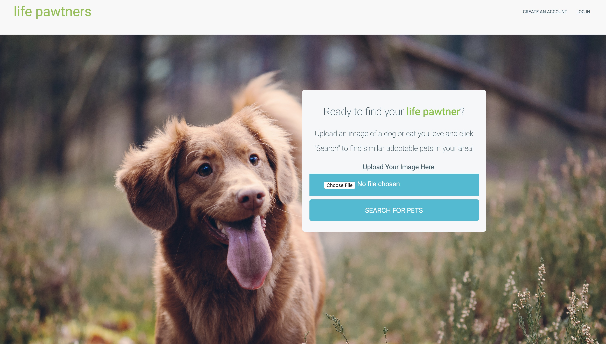
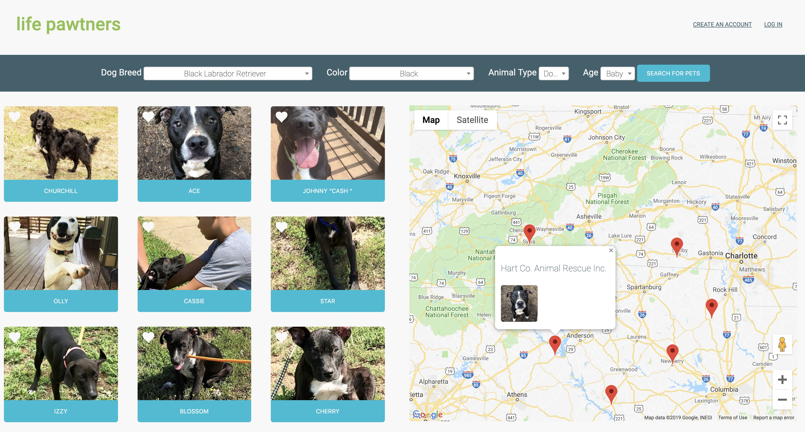
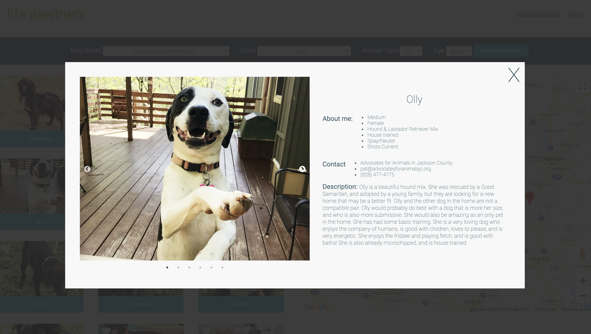
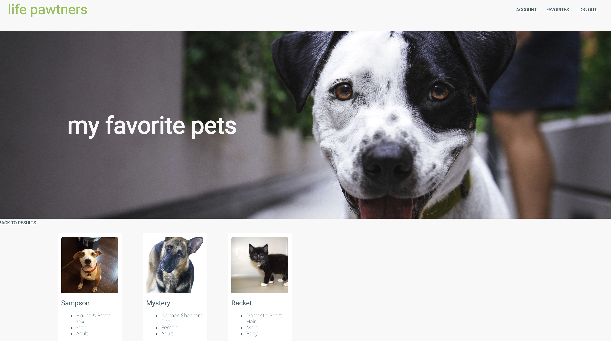

---
# Feel free to add content and custom Front Matter to this file.
# To modify the layout, see https://jekyllrb.com/docs/themes/#overriding-theme-defaults

layout: default
---

[About]({{ site.baseurl }}/) | [Resume]({{ site.resume_url }})

# Life Pawtners

Using IBM Watson’s Visual Recognition program and Petfinder’s API, Life Pawtners allows users to upload images of animals they think look awesome and find local adoptable cats and dogs that are similar to the animals they love. The available pets are then mapped based on location using the Google Maps API.

## Screenshots

#### Homepage

* * *

* * *

#### Search Results

* * *

* * *

#### Details when you click on a pet

* * *

* * *

#### Favorites page

* * *

* * *
