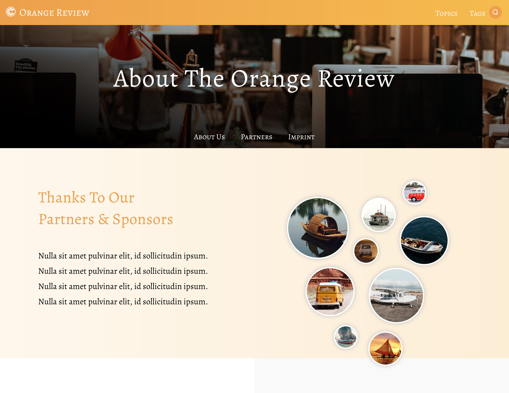

# Carolina Code School

I took a 12 week, full time, and immersive full stack web development course through **[Carolina Code School](https://carolinacodeschool.org/)** located in Greenville, SC. After 9 weeks of intense course work, we created final projects during the last few weeks to demo to the community.

I created **[Life Pawtners]({{site.life_pawtners_details}})**, live app: **[here](https://lifepawtners.herokuapp.com/)**.

Before I was able to create Life Pawtners though, I learned the basics of _HTML/CSS_. _JavaScript_, and _Ruby on Rails_.

* * *
### HTML and CSS
* * *

<div class="project-block" markdown="1">
  We were given mockups that we had to implement in static HTML files as close to pixel perfect as we could. Here are a few from my **[New York 1](https://github.com/emmaconverse/ccs_new_york_layout_1)** and **[New York 2](https://github.com/emmaconverse/ccs_new_york_layout_2)** layouts we were given.
  <div class="project-images">
    
    
  </div>
</div>


* * *
### JavaScript
* * *

I created a variety of JavaScript projects from simple text analyzing projects to creating calculators and shopping carts.

You can view my Calculator and Palindrome detector below or on **[CodePen along](https://codepen.io/emmaconverse)**

#### Calculator

<p class="codepen" data-height="450" data-theme-id="0" data-default-tab="js,result" data-user="emmaconverse" data-slug-hash="KKPgrrG" style="height: 450px; box-sizing: border-box; display: flex; align-items: center; justify-content: center; border: 2px solid; margin: 1em 0; padding: 1em;" data-pen-title="Calculator">
  <span>See the Pen
    <a href="https://codepen.io/emmaconverse/pen/KKPgrrG/">Calculator</a>
    by Emma Converse Hunter (<a href="https://codepen.io/emmaconverse">@emmaconverse</a>)
    on <a href="https://codepen.io">CodePen</a>.
  </span>
</p>
<script async src="https://static.codepen.io/assets/embed/ei.js"></script>

* * *

#### Palindrome Detector
(_Hint_: a palindrome is a word, phrase, or sequence that reads the same backward as forward,

"`Tacocat`" is a palindrome)

<p class="codepen" data-height="450" data-theme-id="0" data-default-tab="js,result" data-user="emmaconverse" data-slug-hash="VwZKqwp" style="height: 450px; box-sizing: border-box; display: flex; align-items: center; justify-content: center; border: 2px solid; margin: 1em 0; padding: 1em;" data-pen-title="Palindrome Detector">
  <span>See the Pen <a href="https://codepen.io/emmaconverse/pen/VwZKqwp/">
  Palindrome Detector</a> by Emma Converse Hunter (<a href="https://codepen.io/emmaconverse">@emmaconverse</a>)
  on <a href="https://codepen.io">CodePen</a>.</span>
</p>
<script async src="https://static.codepen.io/assets/embed/ei.js"></script>


* * *
### Ruby on Rails
* * *

<!-- <div class="project-code-block" markdown="1"> -->

When we started on Ruby we began with fairly simple apps with few models and associations.

Our first project was a **[Bookstore](https://github.com/emmaconverse/ecommerce_bookstore)** that taught us how simple models and controllers work within Rails.

We also incorporated _Devise_ into this app to allow users to have basic login functions.

This is an example of the basic model associations:

```Ruby
class User < ApplicationRecord
  devise :database_authenticatable, :registerable,
         :recoverable, :rememberable, :validatable

  has_many :books, foreign_key: :author_id

  has_many :sales
  has_many :purchased_books, through: :sales,
    class_name: "Book", foreign_key: :book_id
end

# ------------------------------------------

class Sale < ApplicationRecord
  belongs_to :user
  belongs_to :book
end

# ------------------------------------------

class Book < ApplicationRecord
  belongs_to :author, class_name: "User"

  has_many :sales
  has_many :users, through: :sales
end
```
