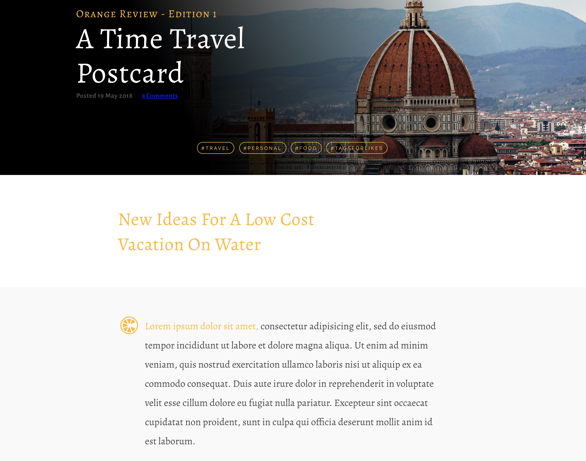

# Carolina Code School

I took a 12 week, full time, and immersive full stack web development course through **[Carolina Code School](https://carolinacodeschool.org/)** located in Greenville, SC. After 9 weeks of intense course work, we created final projects during the last few weeks to demo to the community.

I created **[Life Pawtners]({{site.life_pawtners_details}})**, live app: **[here](https://lifepawtners.herokuapp.com/)**.

Before I was able to create Life Pawtners though, I learned the basics of _HTML/CSS_. _JavaScript_, and _Ruby on Rails_.

* * *
# HTML and CSS
* * *

We were given mockups that we had to implement in static HTML files as close to pixel perfect as we could. Here are a few from my **[New York 1](https://github.com/emmaconverse/ccs_new_york_layout_1)** and **[New York 2](https://github.com/emmaconverse/ccs_new_york_layout_2)** layouts we were given.

{:width="90%"}
* * *
{:width="90%"}
* * *
{:width="90%"}

* * *
# JavaScript
* * *

We had a variety of JavaScript projects that range from analyzing text to creating calculators and shopping carts.

This is an excerpt from the basic Palindrome Detector I created on our first day of JavaScript.

```js
function detectPalindrome(argument) {
  if (typeof argument === 'string') {
    return removeSpaces(argument) === removeSpacesReverse(argument);
  } else {
    return false
  }
}

function removeSpaces(argument) {
  return argument.split(" ").join("")
}

function removeSpacesReverse(argument) {
  return argument.split("").reverse().join("").split(" ").join("")
}
````

I created this **[Calculator](https://github.com/emmaconverse/calculator)** based off of the standard MacBook calculator.

{:width="20%"}


* * *
# Ruby on Rails
* * *

When we started on Ruby we began with very simple apps with few models and associations. Our first project was a **[Bookstore](https://github.com/emmaconverse/ecommerce_bookstore)** that taught us how simple models and controllers work within Rails. Below is a screenshot from the second rails app I created with teammates, **[Blue Review](https://github.com/emmaconverse/blue_review)**, which was also setup like a simple bookstore.

{:width="90%"}

Blue Review's Bookstore example of basic model associations with join tables:
```Ruby

class Author < ApplicationRecord
  has_many :author_posts
  has_many :posts, through: :author_posts
end

#---

class AuthorPost < ApplicationRecord
  belongs_to :author
  belongs_to :post
end

#---

class Post < ApplicationRecord
  belongs_to :author, required: false

  has_many :author_posts
  has_many :authors, through: :author_posts
end
```
