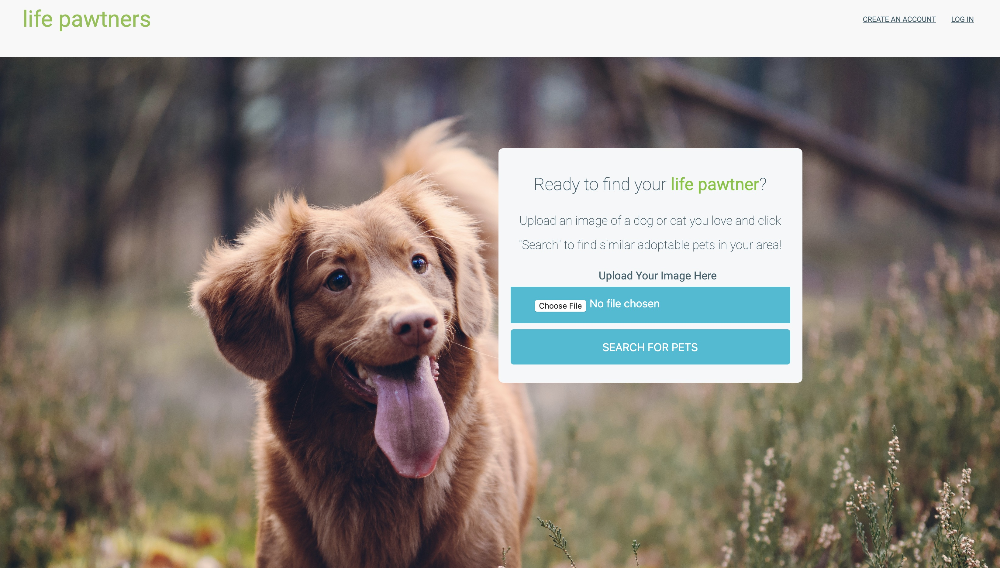
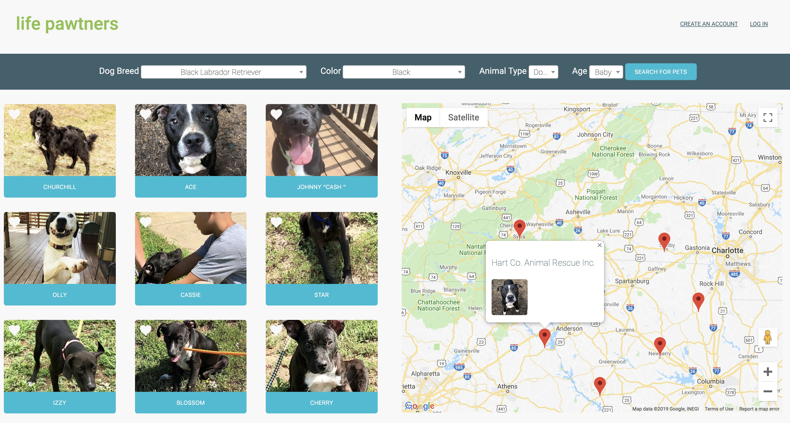
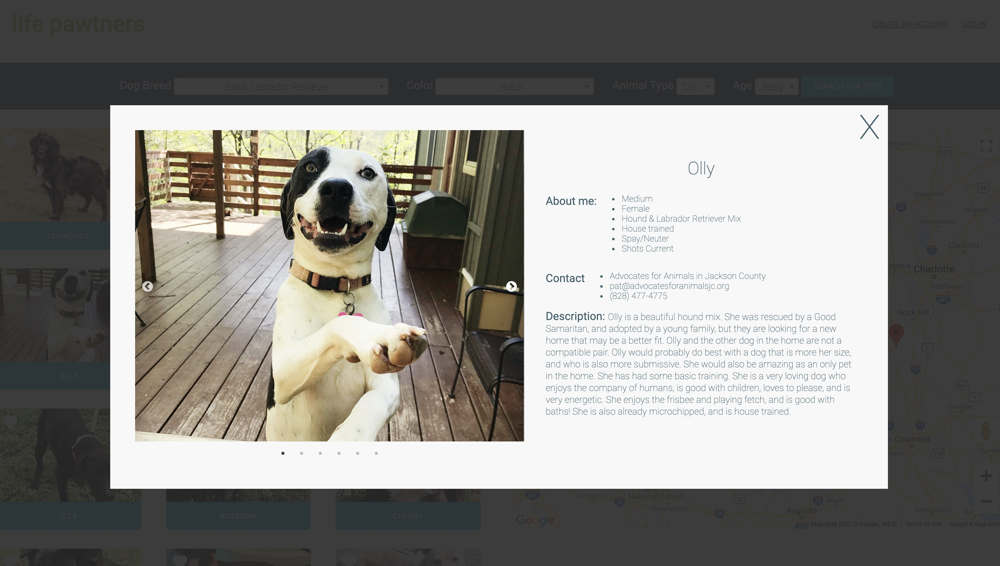
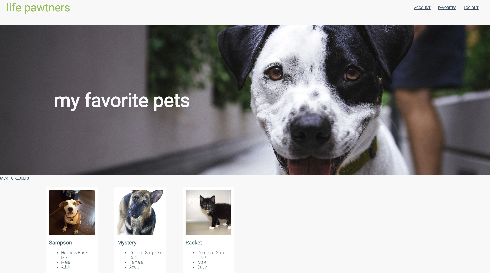

---
# Feel free to add content and custom Front Matter to this file.
# To modify the layout, see https://jekyllrb.com/docs/themes/#overriding-theme-defaults

layout: default
permalink: projects/life_pawtners
---

# Life Pawtners

After 9 weeks of intensive course work, I created this app in about 2.5 weeks.

Using IBM Watson’s Visual Recognition program and Petfinder’s API, Life Pawtners allows users to upload images of animals they think look awesome and find local adoptable cats and dogs that are similar to the animals they love. The available pets are then mapped based on location using the Google Maps API.

Built using: _Ruby, Rails, HTML, JavaScript, CSS, React, jQuery, Petfinder API, IBM Watson Visual Recognition API, Google Maps API_

See the live app here: [Life Pawtners](https://lifepawtners.herokuapp.com/)

## Screenshots

#### Homepage

* * *

* * *

#### Search Results

* * *

* * *

#### Details when you click on a pet

* * *

* * *

#### Favorites page

* * *

* * *
